# Flask afternoon goal
The end goal of this afternoon is to have a Flask app using a Bootstrap template deployed on an Amazon AWS EC2 free tier.

So we'll proceed in two parts:
* Part 1: getting a Flask app using a desired Bootstrap template running locally.
* Part 2: getting that app deployed and running on an EC2 instance.

## Part 1  

### Bootstrap

We use CSS to style html pages. With CSS we can control colors, fonts, spacing and anything else about the appearance.

Instead of working with CSS directly we can use [Bootstrap](http://getbootstrap.com/), which has standard templates.

#### Installation
We'll be downloading code associated with their [examples](http://getbootstrap.com/getting-started/#examples).  Click on this examples link and once on the page click on the _downloading the Bootstrap repository_ link in blue text, as shown below.
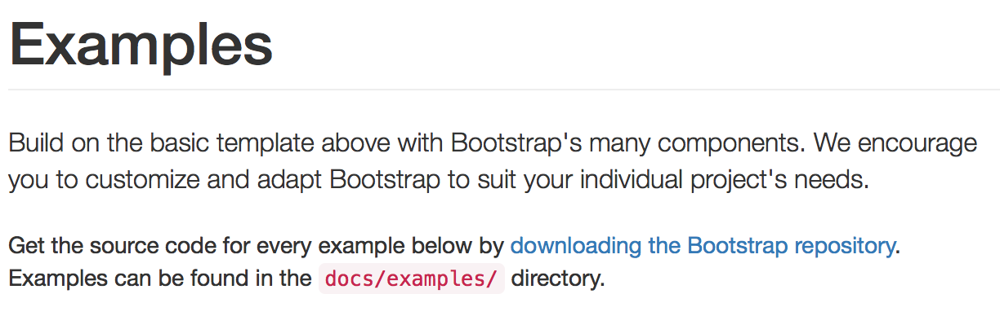

It should be about 5 MB zipped archive that uncompresses to about 11 MB into a directory called `Bootstrap-3.3.7`. It's going to contain the files needed to recreate and then customize our own web page.

#### Starter example
Bootstrap has a bunch of examples built already. It's standard to start with those and modify them for your needs.

Take a look at their [examples](http://getbootstrap.com/getting-started/#examples) again.

We'll start with the simplest one, the [starter template](http://getbootstrap.com/examples/starter-template/).

We're going to want to have the following file structure in a folder called something like `web_app`:

web_app  
* app.py (this is our flask app)  
* templates/ (contains .html files)  
* static/  
  * css/ (contains .css files)  
  * fonts/  (contains fonts)  
  * js/  (contains .js files)

1. Go to `Bootstrap-3.3.7/dist/` and copy the `css`, `fonts`, and `js` folders.  Paste them into your `static` folder. 

1. In `Bootstrap-3.3.7/docs/examples/starter-template` find the `index.html` file and put that in the `templates` folder.  Then drag the `starter-template.css` file into the `static/css` folder.

1. Now, if you open the `index.html` file in your `templates` folder you should see a region where several files are linked:
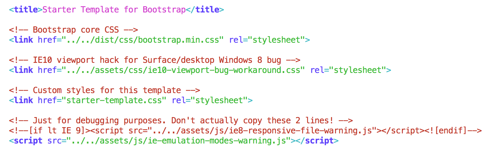

You need to a) find these files in `Bootstrap-3.3.7` and then b) paste them into the following locations in your `static` folder:
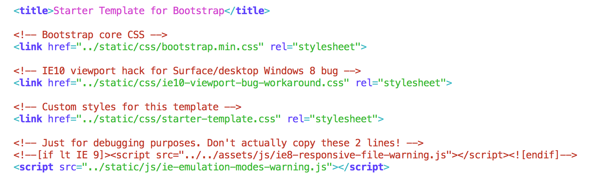

You aren't quite done.  There are some links at the bottom of the `index.html` that need to be updated too:
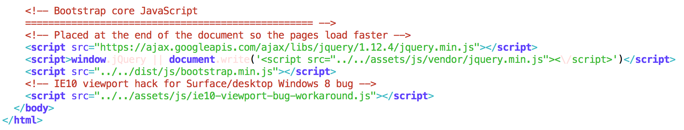

And these links should look like this when you are done:
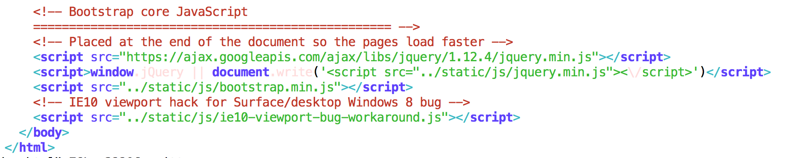

Now see if you can run your app locally.
`$ python app.py`

## Part 2  

1. Get your `web_app` folder up on your Github page. We will be cloning it to our EC2 instance.

1. Log into the AWS Console and Launch an EC2 instance.
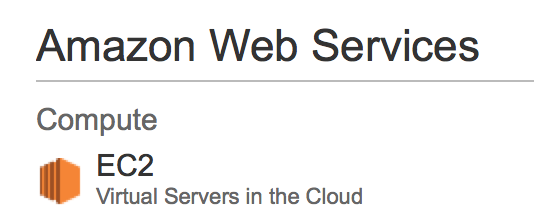

1. Create an instance.
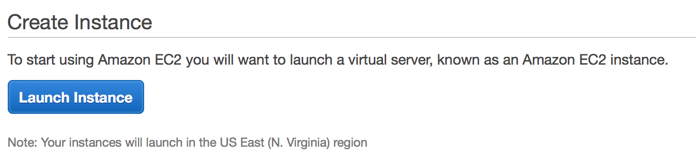

1. Go to community AMI to select a machine image.
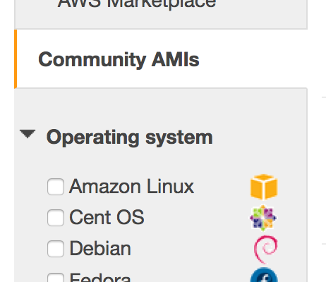

1. Select Erich's DSI template image.
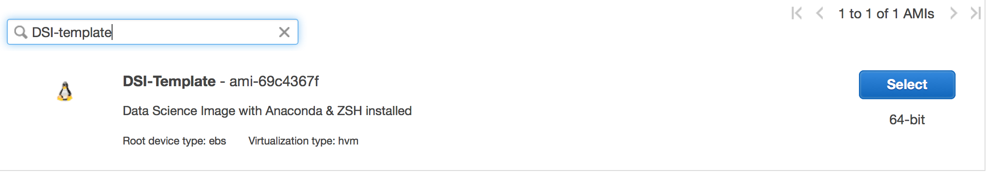

1. Choose the free tier instance.
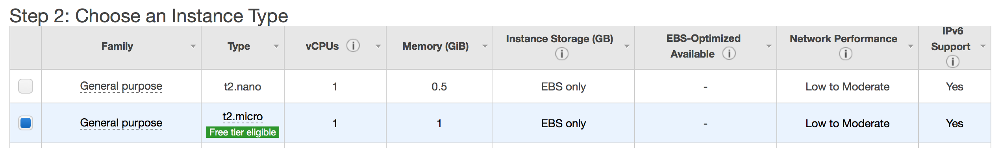

1. Click configure instance details.
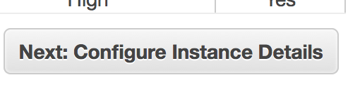

1. Click add storage.
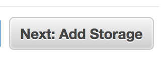

1. Click add tags.
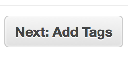

1. Give your tag a name (for instance *my_web_app*).
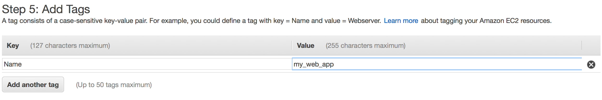

1. Configure your security group by adding a rule.
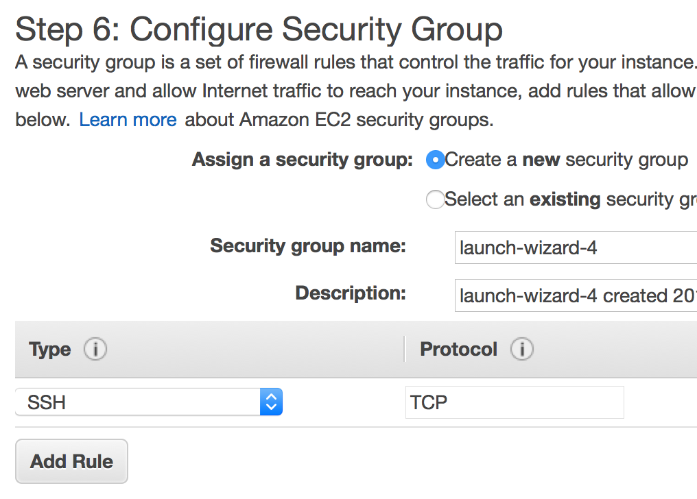

1. Edit inbound rules and select port (using 8105, could use other).
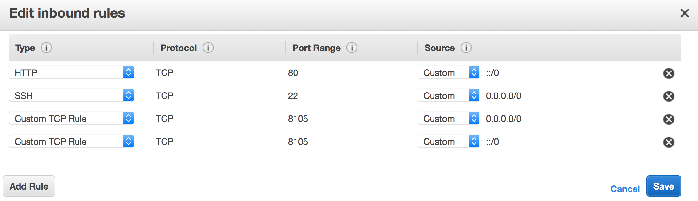

1. Review and launch.
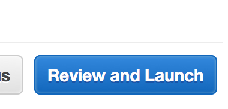

1. Launch.
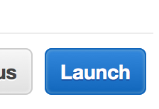

1. Select or make key-pair and download.
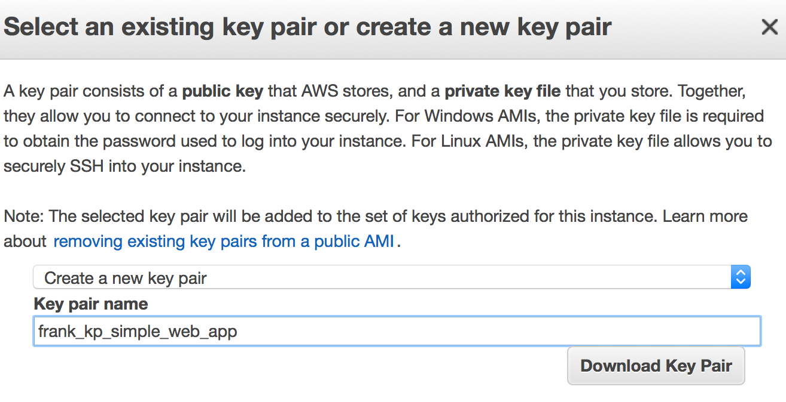

1. Launch the instance.
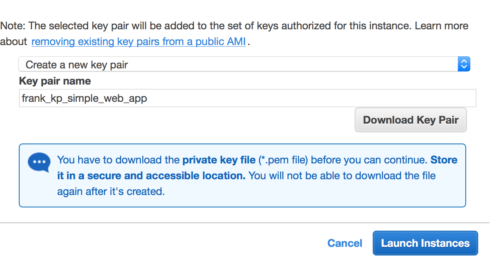

1. Verify that the instance is launched.
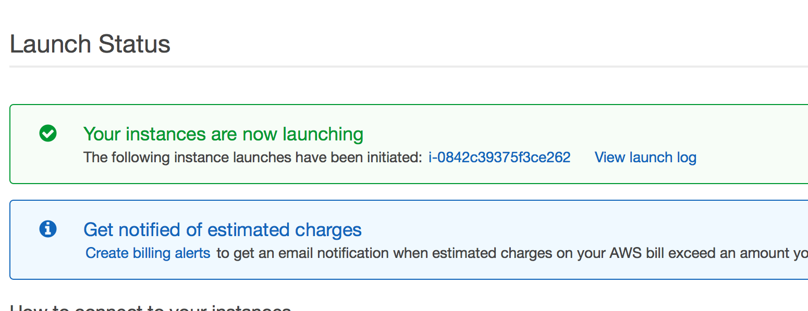

1. Put the key-pair in your local .ssh folder and chmod.

1. Make a config file in .ssh folder
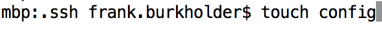

1. Get details of your instance to add to config file.
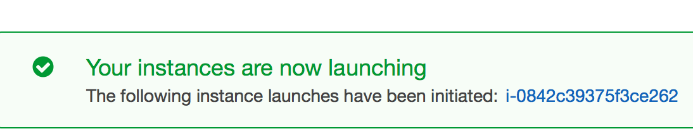

1. Get the IPv4 address from the bottom right.
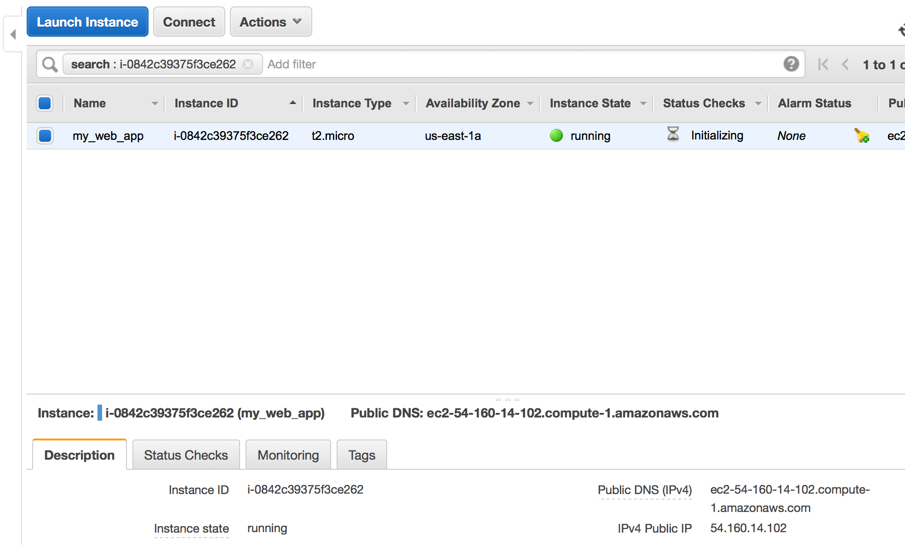

1. Fill in details in the config file and give the Hostname.
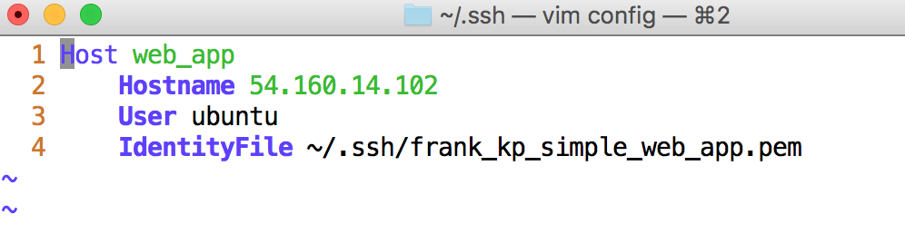

1. Now we can finally ssh into our web_app.
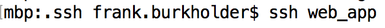

1. Continue connecting.
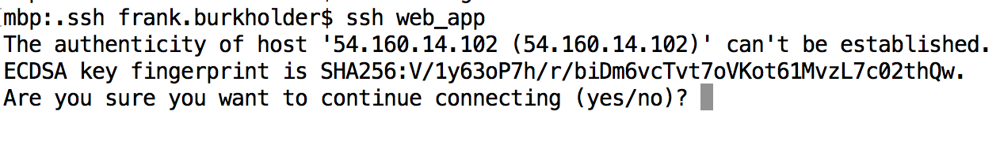

1. Check for updates.
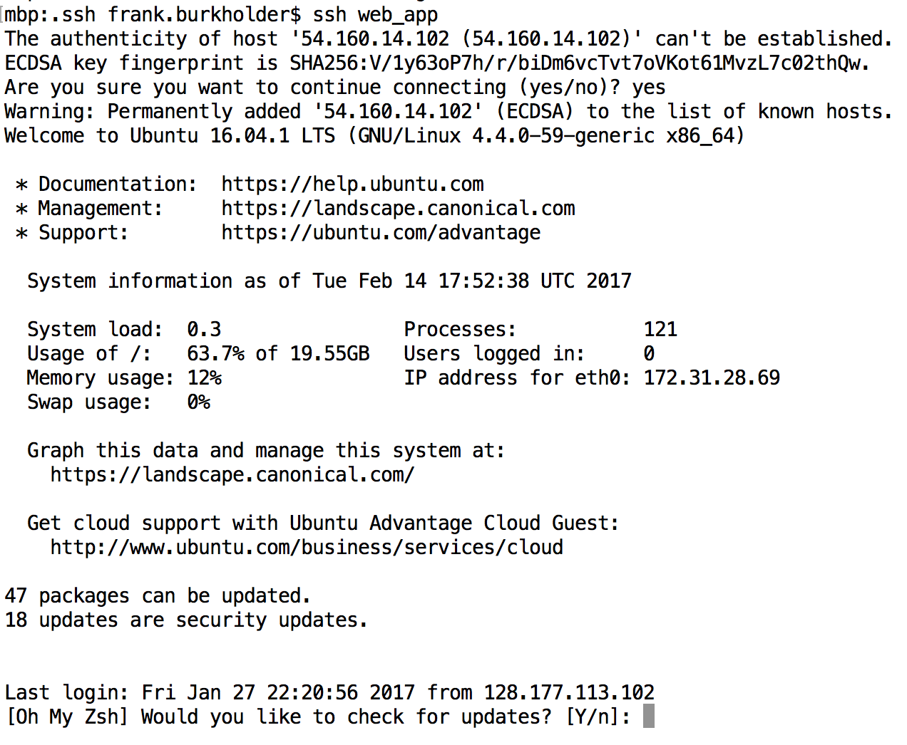

1. Check that you are logged into an ubuntu server.
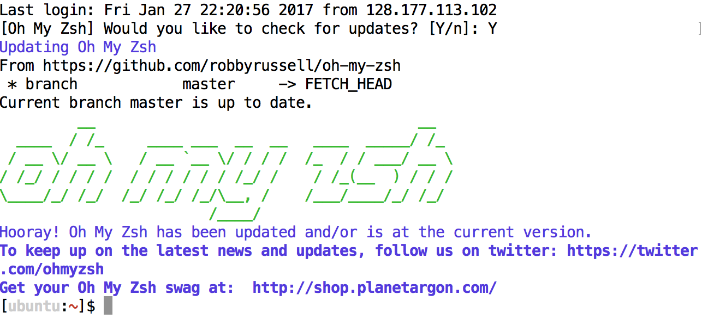

1. Clone your web app on Github.
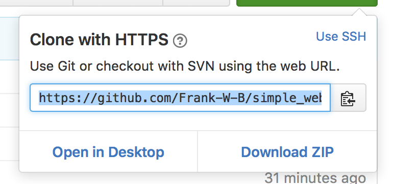

1. Clone it into your EC2 instance.
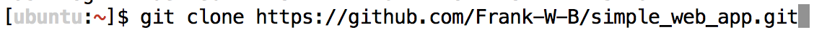

1. Start a `tmux` session.
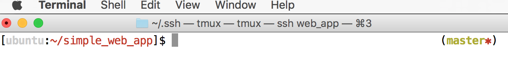

1. Modify your flask app's port to be consistent with the port you specified in your instance, and add threading.

1. Now run your app in the tmux session.
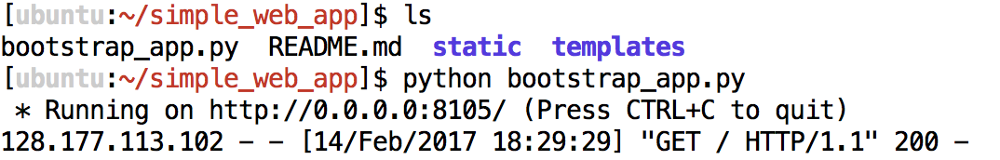

1. Detach (but leave running) your tmux session by hitting Ctrl-b d.
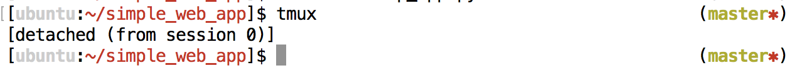

1. Our site, finally, should be deployed!
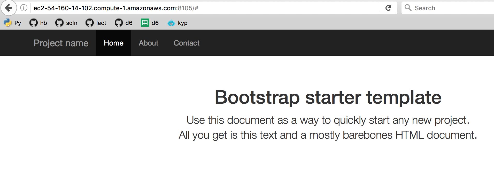

Not hard, right?

Now you can customize by adding and altering html templates in the templates folder.  See the Cooper Corn app.

